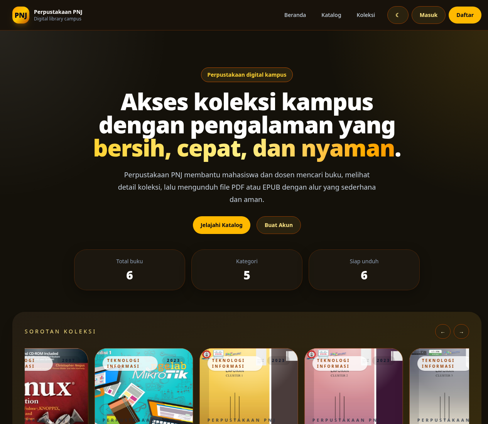

<p align="center">
  
</p>

<p align="center">
  
  
  
  
  
  
</p>

Perpustakaan PNJ adalah katalog digital kampus berbasis Laravel yang memudahkan sivitas akademika mencari, melihat, dan mengunduh koleksi buku secara cepat, rapi, dan responsif. ✨

## 🔎 Project overview

Repositori ini berisi web app perpustakaan untuk PNJ dengan dua lapisan utama:

- tampilan publik untuk menelusuri katalog, melihat detail buku, dan mengunduh file PDF/EPUB yang tersedia
- panel admin Filament di `/admin` untuk mengelola buku, kategori, pengguna, dan ringkasan statistik katalog

Aplikasi ini memakai data demo bawaan sehingga halaman utama dan katalog tetap bisa ditampilkan walau database belum diisi penuh.

## 📸 Showcase

<p align="center">
  
</p>

## ⭐ Main features

- Homepage publik dengan hero section, statistik katalog, carousel sorotan, dan kategori populer
- Pencarian buku berdasarkan judul, penulis, penerbit, atau ISBN
- Filter katalog berdasarkan kategori
- Halaman detail buku dengan cover, metadata, stok, status, dan tautan unduhan
- Alur login, register, logout, dan role admin/user
- Panel admin Filament dengan widget statistik dan grafik buku per kategori
- Seeder demo untuk akun dan koleksi contoh
- Docker Compose untuk environment lokal dengan MySQL dan volume persisten

## 🧱 Tech stack

- Laravel 13
- PHP 8.3+
- Filament 5.6
- Vite
- Tailwind CSS 4
- SQLite untuk setup lokal cepat
- MySQL untuk mode Docker / server produksi lokal
- Docker dan Docker Compose
- Barryvdh Laravel Dompdf

## 📁 Detailed repository structure

```txt
laravel-perpustakaan-pnj/
├── app/
│   ├── Filament/
│   │   ├── Resources/
│   │   └── Widgets/
│   ├── Http/
│   │   ├── Controllers/
│   │   └── Middleware/
│   ├── Models/
│   └── Support/
│       └── LibraryCatalog.php
├── bootstrap/
├── config/
├── database/
│   ├── factories/
│   ├── migrations/
│   └── seeders/
├── docker/
│   ├── entrypoint.sh
│   └── nginx/default.conf
├── public/
├── resources/
│   ├── css/
│   ├── js/
│   └── views/
├── routes/
│   └── web.php
├── assets/
│   ├── logo-perpustakaan-pnj.svg
│   └── showcase-home.png
├── storage/
│   ├── app/public/books/covers/
│   └── app/private/books/
├── Dockerfile
├── docker-compose.yml
├── composer.json
├── package.json
└── README.md
```

## 🧑‍💻 Requirements

- PHP 8.3 atau lebih baru
- Composer
- Node.js 20+ atau 22+ disarankan
- Git
- SQLite untuk setup lokal cepat, atau MySQL jika ingin mengikuti mode Docker
- Docker + Docker Compose, opsional

## ⚙️ Local setup

1. Clone repo ini.
2. Install dependency PHP dan Node.
3. Salin `.env.example` menjadi `.env`.
4. Buat database SQLite jika ingin setup cepat.
5. Generate application key.
6. Jalankan migrasi dan seeder.
7. Buat storage symlink supaya cover buku bisa tampil.
8. Jalankan Vite build atau mode dev, lalu start server Laravel.

Contoh cepat:

```bash
composer install
npm install
cp .env.example .env
mkdir -p database
[ -f database/database.sqlite ] || touch database/database.sqlite
php artisan key:generate
php artisan migrate --seed
php artisan storage:link
npm run build
php artisan serve
```

Akses aplikasi di `http://127.0.0.1:8000`.

## 🌍 How to get the repository

### Recommended: git clone

```bash
git clone https://github.com/OWNER/laravel-perpustakaan-pnj.git
cd laravel-perpustakaan-pnj
```

### Download with curl

```bash
curl -L -o laravel-perpustakaan-pnj.zip https://github.com/OWNER/laravel-perpustakaan-pnj/archive/refs/heads/main.zip
unzip laravel-perpustakaan-pnj.zip
cd laravel-perpustakaan-pnj-main
```

### Download with wget

```bash
wget -O laravel-perpustakaan-pnj.zip https://github.com/OWNER/laravel-perpustakaan-pnj/archive/refs/heads/main.zip
unzip laravel-perpustakaan-pnj.zip
cd laravel-perpustakaan-pnj-main
```

## 🪟 Windows setup

Gunakan PowerShell, Windows Terminal, atau Git Bash.

1. Clone atau download repo.
2. Install dependency:

```powershell
composer install
npm install
```

3. Salin environment file dan siapkan SQLite:

```powershell
Copy-Item .env.example .env
New-Item -ItemType File -Force database/database.sqlite
```

4. Generate app key dan jalankan seeder:

```powershell
php artisan key:generate
php artisan migrate --seed
php artisan storage:link
```

5. Build asset dan jalankan server:

```powershell
npm run build
php artisan serve
```

## 🐧 Linux setup

Cocok untuk Ubuntu, Debian, Fedora, Arch, Mint, dan distro Linux lain.

1. Clone atau download repo.
2. Install dependency:

```bash
composer install
npm install
```

3. Salin environment file dan buat SQLite database:

```bash
cp .env.example .env
touch database/database.sqlite
```

4. Generate key, migrate, dan seed:

```bash
php artisan key:generate
php artisan migrate --seed
php artisan storage:link
```

5. Build asset dan jalankan aplikasi:

```bash
npm run build
php artisan serve
```

## 🔐 Environment variables

`.env.example` sudah disiapkan untuk workflow lokal. Variabel yang paling penting:

```env
APP_NAME="Perpustakaan PNJ"
APP_URL=http://127.0.0.1:8000
DB_CONNECTION=sqlite
DB_DATABASE=database/database.sqlite
```

Jika memakai Docker Compose, gunakan nilai MySQL berikut:

```env
DB_CONNECTION=mysql
DB_HOST=db
DB_PORT=3306
DB_DATABASE=perpustakaan_pnj
DB_USERNAME=perpustakaan_pnj
DB_PASSWORD=secret
```

Catatan:

- jangan commit file `.env`
- file cover dan dokumen buku berada di storage runtime
- credential demo disediakan di seeder untuk kebutuhan lokal

## 🐳 Docker

Repositori ini sudah menyertakan Docker Compose untuk environment lokal dengan MySQL dan volume persisten `db-data`.

### Prerequisites

- Docker Engine + Docker Compose Plugin di Linux
- Docker Desktop di Windows (disarankan dengan WSL2)

### Persiapan file environment

Sebelum menjalankan container, salin file environment dan sesuaikan isinya untuk mode Docker:

```bash
cp .env.example .env
```

Pastikan nilai berikut dipakai untuk mode Docker:

```env
APP_URL=http://localhost:8000
DB_CONNECTION=mysql
DB_HOST=db
DB_PORT=3306
DB_DATABASE=perpustakaan_pnj
DB_USERNAME=perpustakaan_pnj
DB_PASSWORD=secret
```

### Setup Docker di Linux

1. Install Docker dan Docker Compose plugin.
2. Clone repo dan masuk ke folder project.
3. Copy `.env.example` ke `.env` dan update konfigurasi Docker seperti di atas.
4. Jalankan container:

```bash
docker compose up --build
```

5. Buka aplikasi di:

```text
http://localhost:8000
```

Karena command container sudah menjalankan `storage:link`, `migrate`, dan `seed`, aplikasi biasanya langsung siap dipakai setelah service hidup.

Jika ingin menjalankan ulang migrasi secara manual di container:

```bash
docker compose exec app php artisan migrate --seed
```

### Setup Docker di Windows

1. Install Docker Desktop dan aktifkan WSL2 backend jika tersedia.
2. Buka PowerShell, Windows Terminal, atau Git Bash.
3. Clone repo dan masuk ke folder project.
4. Salin `.env.example` menjadi `.env`, lalu pastikan konfigurasi Docker sudah benar.
5. Jalankan service:

```powershell
docker compose up --build
```

6. Akses aplikasi melalui browser:

```text
http://localhost:8000
```

Jika folder storage atau database perlu di-reset, jalankan:

```powershell
docker compose down -v
```

Lalu start ulang dengan `docker compose up --build`.

## 🔑 Demo login

Setelah seeder dijalankan, akun demo berikut tersedia:

- Admin: `admin@pnj.ac.id` / `password`
- User: `user@pnj.ac.id` / `password`
- Teacher: `teacher@pnj.ac.id` / `password`

Panel admin tersedia di `http://127.0.0.1:8000/admin`.

## 📝 Notes / limitations

- Project ini adalah fondasi katalog digital kampus, jadi beberapa alur produksi masih bisa dikembangkan lebih lanjut.
- File buku dan cover berada di storage runtime, sehingga perlu `php artisan storage:link` agar tampil di browser.
- Seeder menyediakan data awal supaya tampilan publik langsung bisa diuji.
- Panel admin menggunakan Filament dan mengikuti role-based access sederhana.
- Build validation pada repo ini sudah lolos dengan `php artisan test` dan `npm run build`.
